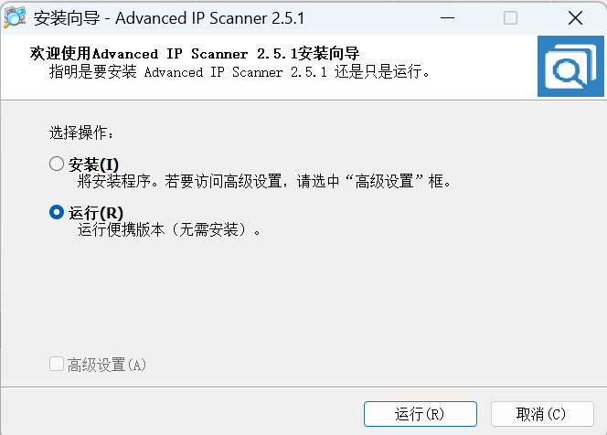
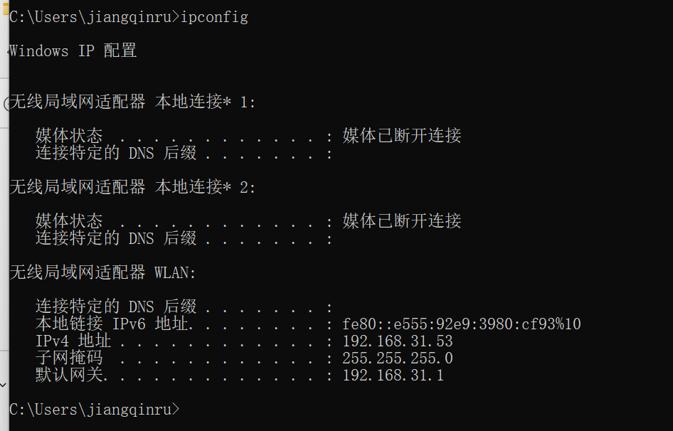
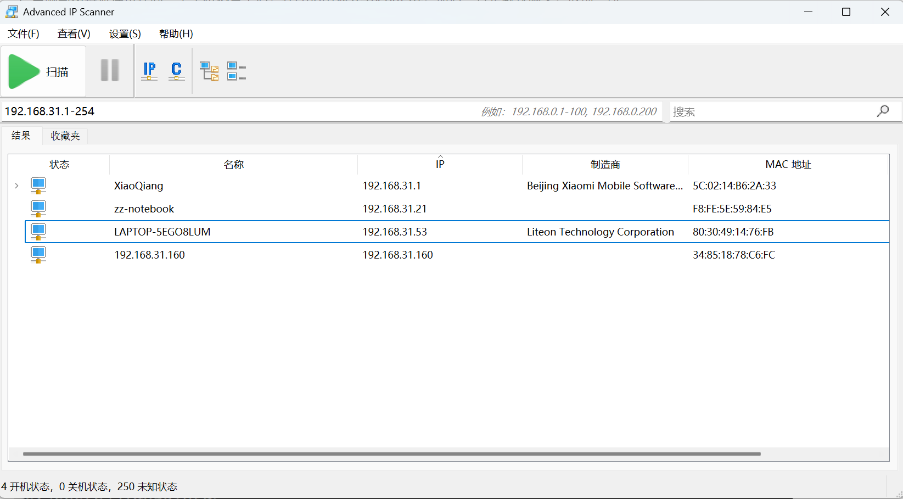

# 软件组

### 一、树莓派硬件结构

- **树莓派4**：硬件结构如下：


我们用得到的接口有引脚、USB-C电源、Micro HDMI接口、USB 3.0接口，下面分别说明每个接口的作用：

|        名称        |                   作用                    |
| :----------------: | :---------------------------------------: |
| USB-C电源（5V/3A） |                调试时使用                 |
|        引脚        |         用于供电和与板子进行通信          |
|     Micro HDMI     | 连接显示屏（注意连接时使用micro转HDMI线） |
|    USB 3.0接口     |           连接摄像头、USB声卡等           |

- **树莓派5**：硬件结构如下图：


树莓派4和5之间的区别有：电源使用5V/5A的适配器、USB和网线接口的位置发生变化（这个会导致板子形状和树莓派不符合），同时在机器人调试时不使用引脚进行供电，而是使用转换器给TYPE-C口进行供电。

我们的任务主要在于树莓派和板子进行通信，机械部分与树莓派的关系不大。

---

### 二、环境配置

#### 1.所需环境

- pytorch，用于yolov5在树莓派上的视觉识别（树莓派5上使用，4上没有用yolo）。
- opencv，以及相关的最基本的依赖。
- vosk，一个离线的语音识别库。
- pyaudio，韵律识别必须安装的库，可以进行声音采样。
- movenet，姿态识别调用。
- serial，串口通信使用。
- librosa，韵律识别需要用到的库。
- snowboy，语音唤醒用到的模型，这个建议手动进行部署。

#### 2.开机自启动

我们使用的是基于桌面的开机自启动程序，之前试了很多办法，只有这个有效，但是自启动的时间稍微长一点。

```
cd /home/pi/.config
```

在这个目录下创建 autostart 文件夹，然后创建一个 .desktop 文件，在这个文件中写入开机自启的应用，为了保险起见，我们在这里启动一个sh脚本，再在脚本里激活虚拟环境、运行 main.py 文件。这样做的好处很多，比如可以在脚本中激活虚拟环境、在更换启动文件时可以直接修改sh脚本以实现目的。

.desktop 的文件内容示例：

```
[Desktop Entry]
Encoding=UTF-8
Type=Application
Name=myprogram
# 这个Exec建议运行sh脚本，我将sh脚本的位置放在了桌面，名字应该叫start.sh
Exec=lxterminal -e bash -c 'python3 /home/pi/Desktop/test.py;$SHELL'
Terminal=true
```

#### 3.虚拟环境

在树莓派5中，有很多依赖无法通过 pip 直接安装，终端给出的报错是有可能破环系统的环境，这时可以使用命令强行安装，但我们使用了虚拟环境进行安装，这样不会有意外的报错，但是麻烦在于每次进行调试和运行程序都需要激活虚拟环境。相应的命令为

```
source /home/pi/myenv/bin/activate
```

此时激活环境后再运行代码，自启动中可以将这行代码写入sh文件以实现开机自动激活虚拟环境。

（PS：建议可以用一个卡试一试不使用虚拟环境）

#### 4.代码编写

树莓派4上使用 thonny 这个工具进行编写，但树莓派5上可能由于分辨率的原因，这个打开后代码显示不全，我一般使用 vim 进行修改。

---

### 三、代码部分

主要模型：snowboy，vosk，movenet

-  [main.py](./main.py)：主文件，运行进入逻辑循环


- [snowboydecoder.py](./snowboydecoder.py) ：调用snowboydetect模型进行热词唤醒，调用 speech_recog.py 获得文本 text ，传入 action_neo.py 进行行为逻辑判断


- [speech_recog.py](./speech_recog.py) ：语音识别，主要逻辑是先进行几秒的录音，存储在临时文件里，然后再调用模型识别结果，并将结果传给 action_neo.py 。


- [action_neo.py](./action_neo.py)： 主要行为逻辑，调用 pose_estimate.py 和 rhythm_recog.py ，用于完成要求的姿态识别、韵律识别。


- [pose_estimate.py](./pose_estimate.py)：姿态识别，识别的方法是获取人体18个关键点，然后判断相应的位置长度关系来确定姿势。


- [rhythm_recog.py](./rhythm_recog.py)：韵律识别，提前选择歌曲进行训练，原理是获取音乐鼓点并进行声音采样记录，然后识别时判断正在播放的歌曲鼓点更靠近哪个训练曲目（所以最后一定会识别出一个结果，就算播放非训练曲目也会得到结果）。
-  [character.py](./character.py)：这个文件是yolo的目标检测，只在奇乐的树莓派5上使用了，放在yolov5的文件夹下
- [speech_recog.py](./speech_recog.py) ：语音识别


需要注意的是，每个机器人应该根据功能进行代码调用，比如人形没有目标检测的环节，所以不使用 yolov5 进行检测，异形没有姿态检测的环节，所以没有用到 pose_estimate.py 的代码。

改进的空间有以下：

- 代码结构和逻辑可以进一步优化，action_neo 里的字典可以存储在json文件里，使用的时候读取。
- yolov5 的性能有待加强，一般在树莓派4上只有 3 FPS 的效率，可以将将YOLOv5s.pt模型转为ONNX中间模型后再转为IR模型，加快推理速度和帧率。
- 创意赛可以加入离线大语言模型的部署，比如 llama2 等，不用实现很高效率，只要有这个智能化的功能就能薄纱其他学校。看到了一篇文章可以参考一下：[在树莓派上运行语音识别和 LLama-2 GPT! | 树莓派实验室](https://shumeipai.nxez.com/2024/03/17/a-weekend-ai-project-running-speech-recognition-and-a-llama-2-gpt-on-a-raspberry-pi.html)

---

### 四、调试部分

#### 1.RealVNC

在调试时，我们一般使用 VNC 进行远程连接， realvnc 的好处是可以远程查看桌面，但也存在很多问题，比如卡顿、偶尔断联，如果熟悉命令行操作的话，可以使用 Xshell、VScode 进行 ssh 连接。

在使用realvnc的时候，注意电脑端下载的是 vncviewer ，树莓派端下载的是 vncserver，连接的用户名（如果有）应该是 pi ，密码是111111.

需要注意的是，在不用的局域网下，设备的 ip 应该是动态分配的，所以每次进行连接时，同一个树莓派的 IP 地址可能会发生变化，这个时候一般只能连接显示屏 ipconfig 查看ip地址，如果是手机热点有的可以查看连接到本机的设备ip，或者下载一个手机端命令行软件 [android terminal ](https://jackpal.github.io/Android-Terminal-Emulator/downloads/Term.apk  输入ip neigh进行查看。

另外使用 VNC、SSH 时注意树莓派 config 里是否开启相应功能（但用过的树莓派应该都是开启的）

#### 2.显示器

组里应该有 micro HDMI 转 HDMI、micro HDMI 转 mini HDMI的线，前者连接正常显示屏，后者连接小显示屏（我们用的是朱坤的显示屏，你们可以自己买一个，比赛时调试也方便，这个很重要）

#### 3.声卡

我们使用的声卡是外接的USB声卡，我们买的逻辑摄像头虽然也带声卡，但识别的效果不好，注意在树莓派里设置输入声卡为USB

#### 4.输出设备

2024比赛我们尝试了使用蓝牙连接音响，在基地调试时效果很好，但在比赛场地上一直断连，如果有那种外置接收器音响的话可以试一试。

---

### 五、ip地址查询

找到了一个通用的方便的不用连接显示屏查看树莓派ip地址的方法（前提是你先提前把树莓派默认连接热点设置为对应机械同事的手机）

使用**Advanced_IP_Scanner_2.5.4594.1.exe**

1. 可以只点击运行



2. 电脑与树莓派连接在同一个手机热点下后，在cmd中输入`ipconfig`，最后一行是默认网关，取前三段



3. 最后一段输入查找范围，即可查看连接在手机热点下的所有设备的ip地址



4. 名称为raspberry的即树莓派，如果没有显示名称，很多手机上有显示连接热点的MAC地址，可以据此对照
5. 有的人的手机特别好，在设置里点开就直接能查看连接自己手机热点的设备的ip地址，那就不用上面这套流程了

---

### 六、姿态识别

我们使用了新的姿态识别算法，与往常的描点不同，现在是通过svm算法对每一帧进行姿态识别，代码已经写好了（有一份不在项目文件中的posture_identification，已经发送给你们），你们只用拍摄数据集然后跑一下代码就行。具体操作请查看posture_identification中的README。

可以设置的参数有：摄像头旋转角度，稳定时长（保持多久的稳定姿势后返回结果，设置这个是避免误触），超时时长（多长时间内没有识别到任何姿态即退出，目的是防卡死）

因为唤醒容易出差错，我们改成了一次唤醒，连续识别。退出条件：识别到“结束姿势”（双手交叉）、15s未识别到稳定姿势、摄像头损坏。

有一些时候会出现识别不到摄像头的情况，比较大的概率是 接触不良、USB口损坏、摄像头损坏，如果一到姿态识别环节，很短的时间内就说超时，可以判断为是识别不到摄像头（因为我放的音频是timeout.MP3，你们也可以换一个专门的指示音频）

还有比较小的概率是代码上有改进空间，我在红莲的代码文件中为检测摄像头添加了更多处理，你们可以再试试

拍摄数据集的时候背景最好使用白幕布，多拍一些

---

### 七、语音识别

由于唤醒效果不稳定，我们改成了一次唤醒，连续识别。不过也加了个保险，万一上场的时候紧张忘记先说“语音识别”再说指令，也没关系。结束语音识别就是说“结束”，或者三次没识别到关键词就自动结束。

我们目前使用的是python的vosk库，虽然总是识别出一些莫名其妙的词，但是是我们目前找到的效果比较好的适合在树莓派上跑的。你们可以找找有没有效果更好的语音识别模型。

针对vosk总是出现莫名奇妙的词，我想出的办法是把这些词全部映射到我们要识别的关键词上。写了一个自动采集脚本（speech_train.py)，你们跑一遍就知道怎么用了，映射关系定义在speech_train.json中。

word.txt是日志，记录每一次识别失败时机器人听到了什么。

---

### 八、命名规范

之前的代码采用字典法枚举 指令、音频、数据包的映射关系，还要手动转数据包，很麻烦而且浪费时间。现已将转化数据包的代码内嵌在项目文件中，可以自动转化。

具体命名要求请查看发给你们的《命名规范》，关键是 指令、音频、动作文件名要一一对应，这是减少手动枚举工作量的关键。

以下是节选，并非一定完全按照这上面命名，关键是要统一好，机械和软件商量。

